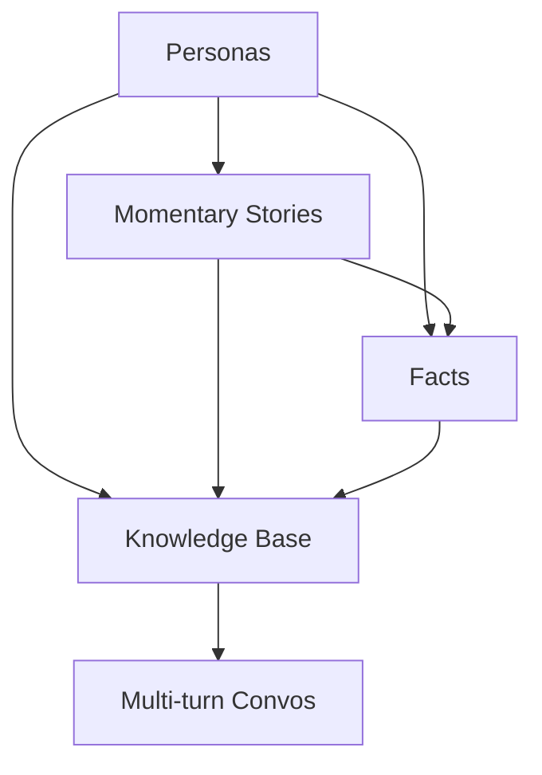

## Memory Agent Data Generation Pipeline

### Data Generation Steps



#### Personas

```python
class Gender(str, enum.Enum):
    MALE = "male"
    FEMALE = "female"

class Relationship(BaseModel):
    name_surname: str
    relationship: str

class Birthplace(BaseModel):
    city: str
    country: str

class Persona(BaseModel):
    name_surname: str
    age: int
    gender: Gender
    birthplace: Birthplace
    occupation: str
    detailed_backstory: str
    relationships: List[Relationship]
```

#### Momentary Stories

```python
class MomentaryPersonaStory(BaseModel):
    timestamp: datetime
    story: str

class MomentaryPersonaStories(BaseModel):
    name_surname: str
    stories: List[MomentaryPersonaStory]

class MomentaryStories(BaseModel):
    stories: List[MomentaryPersonaStories]
```

#### Knowledge Base

```python
class PersonaWithStories(BaseModel):
    persona: Persona
    stories: List[MomentaryPersonaStory]

    model_config = ConfigDict(json_encoders={datetime: lambda dt: dt.isoformat()})

class PersonasWithStories(BaseModel):
    personas: List[PersonaWithStories]

    model_config = ConfigDict(json_encoders={datetime: lambda dt: dt.isoformat()})

class Fact(BaseModel):
    fact_description_or_change: str
    timestamp: Optional[datetime] = None

    model_config = ConfigDict(json_encoders={datetime: lambda dt: dt.isoformat()})

class PersonalFact(BaseModel):
    name_surname: str
    facts: List[Fact]

    model_config = ConfigDict(json_encoders={datetime: lambda dt: dt.isoformat()})

class PersonalFacts(BaseModel):
    facts: List[PersonalFact]

    model_config = ConfigDict(json_encoders={datetime: lambda dt: dt.isoformat()})

class KnowledgeBaseItem(BaseModel):
    persona_with_stories: PersonaWithStories
    facts: List[Fact]

    model_config = ConfigDict(json_encoders={datetime: lambda dt: dt.isoformat()})

class KnowledgeBase(BaseModel):
    items: List[KnowledgeBaseItem]

    model_config = ConfigDict(json_encoders={datetime: lambda dt: dt.isoformat()})
```

### Multiturn Convos

```python
class UserChatTurn(BaseSchema):
    turn_number: int
    base_fact: str
    user_message: str

class MultiTurnConvo(BaseSchema):
    user_persona_name_surname: str
    user_chats: List[UserChatTurn]
    facts_to_check: List[Fact]

class MultiTurnConvos(BaseSchema):
    convos: List[MultiTurnConvo]
```
