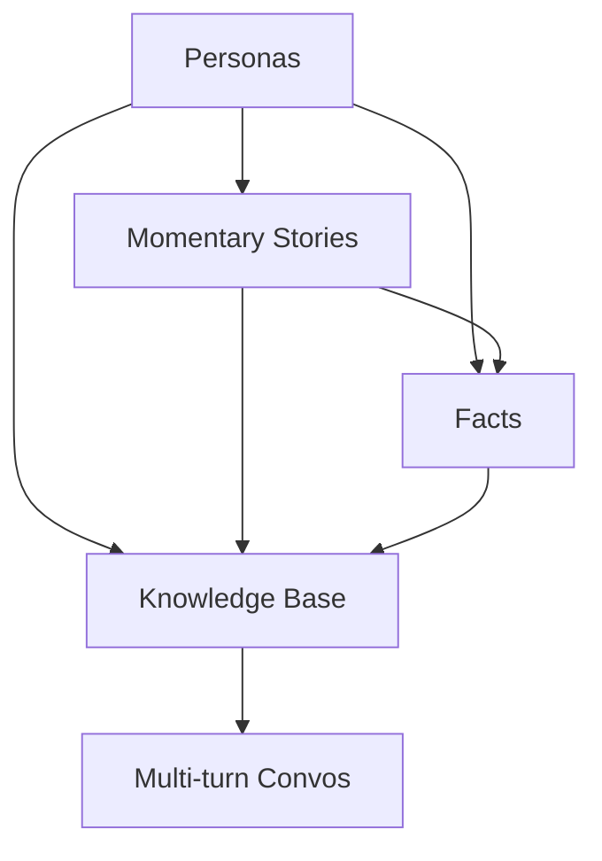

## Memory Agent Data Generation Pipeline

### Data Generation Steps

Three main tasks to be covered by the agent:
1. **Introduction of new information to the memory**:
    - Checking the guideline to see if any rule related to this info exists
        - **if guideline rule(s) exist(s):** Add info to the memory, abiding to the rule(s)
        - **else:** Add info the memory and update the guideline
2. **Updating existing information in the memory**:
    - Checking the guideline to see if any rule related to this info exists
        - **if guideline rule(s) exist(s)**, check if information exists in the memory
            - **if information exists in the memory** Update the memory following the guideline(s)
            - **else**: Add new info to the memory, following the guideline()
        - **else:** Add info the memory and update the guideline
3. **Checking the memory to see if existing info can be used to assist the user**
    - Checking the guideline to see if any rule related to this info exists
        - **if guideline rule(s) exist(s)**, check if information exists in the memory
            - **if information exists in the memory** Retrieve the information and use it in assisting the user
            - **else**: Do nothing, proceed
        - **else:** Do nothing, proceed
    
